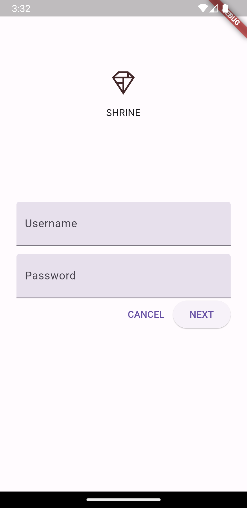
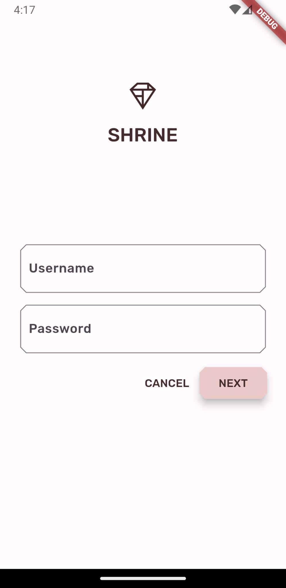
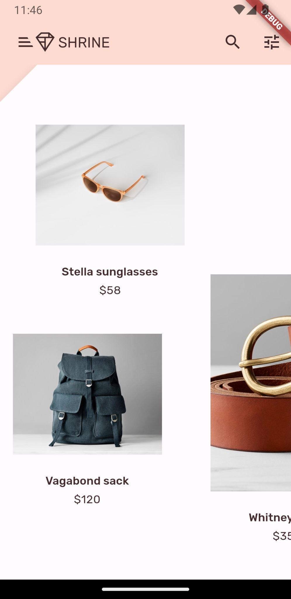
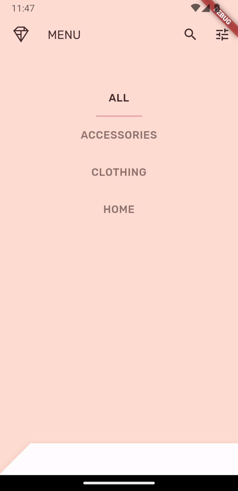

### Flutter Material Design Components codelabs

| [MDC-101](https://codelabs.developers.google.com/codelabs/mdc-101-flutter) | [MDC-102](https://codelabs.developers.google.com/codelabs/mdc-102-flutter) | [MDC-103](https://codelabs.developers.google.com/codelabs/mdc-103-flutter) | MDC-103 |
|----|----|----|----|
|||||

| [MDC-104](https://codelabs.developers.google.com/codelabs/mdc-104-flutter) | MDC-104 |
|----|----|
|||